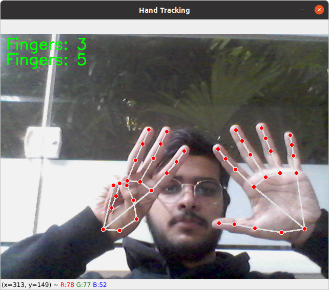

# Hand Control System

## Descrição

Este projeto utiliza a biblioteca MediaPipe e a OpenCV para reconhecer gestos das mãos e realizar ações no computador, como mover o mouse, clicar e rolar. Ele também inclui uma interface gráfica feita com Tkinter para executar diferentes scripts.
O Projeto possui codigos exemplos de como cada funcionalidade foi construida e arquivos MD explicando passo a passo os códigos.

## Funcionalidades

- Reconhecimento de gestos para controle do mouse.
- Interface gráfica com Tkinter para executar diferentes scripts.
- Contagem de dedos usando MediaPipe.
- Controle do Volume.

## Estrutura do Projeto

```
hand-control-system/
├── test/
│   └── GUI-test/
│       ├── app.py           # Script principal com a interface gráfica
│       ├── script1.py       # Exemplo de script 1
│       ├── script2.py       # Exemplo de script 2
│       ├── script3.py       # Exemplo de script 3
│       ├── script4.py       # Exemplo de script 4
│       └── script5.py       # Exemplo de script 5
```

## Como Baixar

1. Clone o repositório:
   ```bash
   git clone https://github.com/josegustavo12/hand-control-system
   cd hand-control-system
   ```

2. Navegue até o diretório `GUI-test`:
   ```bash
   cd test/GUI-test
   ```

## Instalação das Bibliotecas

Certifique-se de ter o Python 3 instalado. Você pode instalar as bibliotecas necessárias usando `pip`:

```bash
pip install opencv-python-headless mediapipe numpy pyautogui
```

## Como Executar

1. **Certifique-se de que a estrutura do diretório esteja correta conforme descrito.**
2. **Execute o script principal:**
   ```bash
   python3 app.py
   ```

## Código

### `app.py`

```python
import tkinter as tk
from tkinter import messagebox
import subprocess
import os

# caminho para o script (substitua aqui com o caminho desejado)
scripts_dir = "/home/jose/Documentos/GitHub/hand-control-system/test/GUI-test"

# funções que executam o script
def script1():
    try:
        subprocess.run(["python3", os.path.join(scripts_dir, "script1.py")], check=True)
        messagebox.showinfo("Script 1", "Script 1 executado com sucesso!")
    except subprocess.CalledProcessError as e:
        messagebox.showerror("Erro", f"Erro ao executar Script 1: {e}")

def script2():
    try:
        subprocess.run(["python3", os.path.join(scripts_dir, "script2.py")], check=True)
        messagebox.showinfo("Script 2", "Script 2 executado com sucesso!")
    except subprocess.CalledProcessError as e:
        messagebox.showerror("Erro", f"Erro ao executar Script 2: {e}")

def script3():
    try:
        subprocess.run(["python3", os.path.join(scripts_dir, "script3.py")], check=True)
        messagebox.showinfo("Script 3", "Script 3 executado com sucesso!")
    except subprocess.CalledProcessError as e:
        messagebox.showerror("Erro", f"Erro ao executar Script 3: {e}")

def script4():
    try:
        subprocess.run(["python3", os.path.join(scripts_dir, "script4.py")], check=True)
        messagebox.showinfo("Script 4", "Script 4 executado com sucesso!")
    except subprocess.CalledProcessError as e:
        messagebox.showerror("Erro", f"Erro ao executar Script 4: {e}")

def script5():
    try:
        subprocess.run(["python3", os.path.join(scripts_dir, "script5.py")], check=True)
        messagebox.showinfo("Script 5", "Script 5 executado com sucesso!")
    except subprocess.CalledProcessError as e:
        messagebox.showerror("Erro", f"Erro ao executar Script 5: {e}")


# cria a janela principal
root = tk.Tk()
root.title("Controle de Scripts")
root.geometry("400x300")
root.configure(bg="#2C3E50")

# estilização dos botoes
button_style = {
    "font": ("Helvetica", 12, "bold"),
    "bg": "#3498DB",
    "fg": "white",
    "relief": tk.RAISED,
    "bd": 3,
    "width": 20,
    "height": 2,
}

# add os botoes a janela e coloca o que eles tem que fazer (command)
button1 = tk.Button(root, text="Count Fingers", command=script1, **button_style)
button1.pack(pady=10)

button2 = tk.Button(root, text="Pyautogui Mouse", command=script2, **button_style)
button2.pack(pady=10)

button3 = tk.Button(root, text="Volume Hand Control", command=script3, **button_style)
button3.pack(pady=10)

button4 = tk.Button(root, text="Projeto final", command=script4, **button_style)
button4.pack(pady=10)

root.mainloop()

```
## Funcionamento 
### GUI:


### Script 1 (Count Fingers):




### Script 2 (Pyautogui Mouse):
- Digita um comando no terminal e o mouse irá executar
    - (move 540 879) ele irá mover para as coordenadas x = 540 e y = 879
### Script 3 (Volume Hand Control):


### Script 4 (Projeto final):
O projeto final possui os seguintes comandos:
- Todos os dedos abaixados e apenas o `indicador` levantado: Mover o mouse na direção do dedo
- Dedo indicador e do meio levantados: scroll do mouse (juntos = 0; separados aumenta)
- dedos abaixados e sinal de pinça (encostar o dedo indicador com o polegar): left click


## Autor

José Gustavo Victor Pinheiro Alencar

